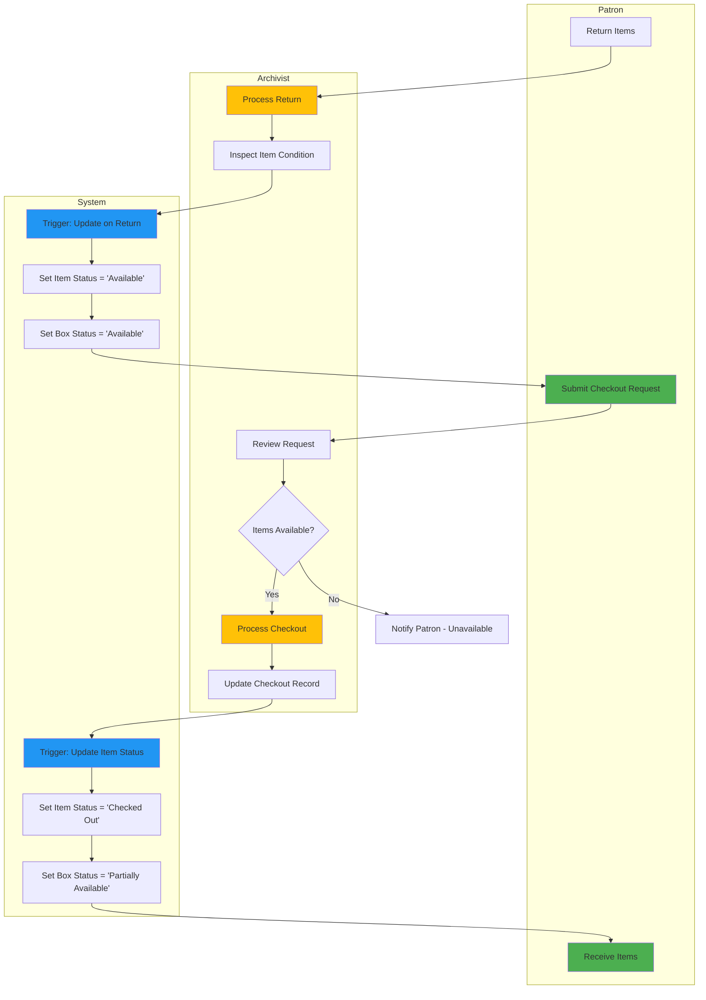

## Workflow Mapping for the Scenario

<b>🔄 Patron Checkout Workflow</b>

```mermaid
graph TB
    subgraph Patron
        A[Submit Checkout Request]
        K[Receive Items]
        L[Return Items]
    end
    
    subgraph Archivist
        B[Review Request]
        C{Items Available?}
        D[Process Checkout]
        E[Update Checkout Record]
        M[Process Return]
        N[Inspect Item Condition]
    end
    
    subgraph System
        F[Trigger: Update Item Status]
        G[Set Item Status = 'Checked Out']
        H[Set Box Status = 'Partially Available']
        O[Trigger: Update on Return]
        P[Set Item Status = 'Available']
        Q[Set Box Status = 'Available']
    end
    
    A --> B
    B --> C
    C -->|No| R[Notify Patron - Unavailable]
    C -->|Yes| D
    D --> E
    E --> F
    F --> G
    G --> H
    H --> K
    L --> M
    M --> N
    N --> O
    O --> P
    P --> Q
    Q --> A
    
    style A fill:#4CAF50
    style K fill:#4CAF50
    style D fill:#FFC107
    style M fill:#FFC107
    style F fill:#2196F3
    style O fill:#2196F3
```

